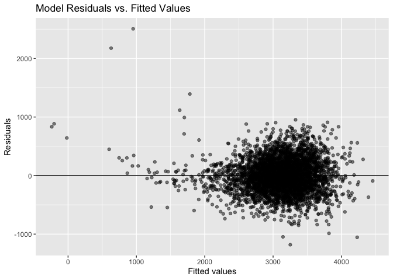
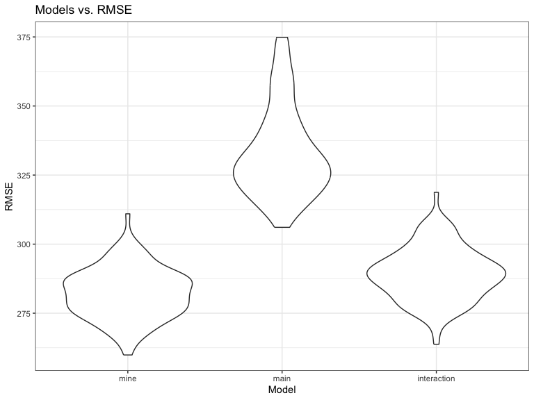

p8105_hw6_yw4199
================
Yaduo Wang
2023-11-29

``` r
library(tidyverse)
```

    ## ── Attaching core tidyverse packages ──────────────────────── tidyverse 2.0.0 ──
    ## ✔ dplyr     1.1.3     ✔ readr     2.1.4
    ## ✔ forcats   1.0.0     ✔ stringr   1.5.1
    ## ✔ ggplot2   3.4.3     ✔ tibble    3.2.1
    ## ✔ lubridate 1.9.2     ✔ tidyr     1.3.0
    ## ✔ purrr     1.0.2     
    ## ── Conflicts ────────────────────────────────────────── tidyverse_conflicts() ──
    ## ✖ dplyr::filter() masks stats::filter()
    ## ✖ dplyr::lag()    masks stats::lag()
    ## ℹ Use the conflicted package (<http://conflicted.r-lib.org/>) to force all conflicts to become errors

``` r
library(modelr)
library(mgcv)
```

    ## Loading required package: nlme
    ## 
    ## Attaching package: 'nlme'
    ## 
    ## The following object is masked from 'package:dplyr':
    ## 
    ##     collapse
    ## 
    ## This is mgcv 1.9-0. For overview type 'help("mgcv-package")'.

## Problem 2

``` r
# download the data
weather_df = 
  rnoaa::meteo_pull_monitors(
    c("USW00094728"),
    var = c("PRCP", "TMIN", "TMAX"), 
    date_min = "2022-01-01",
    date_max = "2022-12-31") |>
  mutate(
    name = recode(id, USW00094728 = "CentralPark_NY"),
    tmin = tmin / 10,
    tmax = tmax / 10) |>
  select(name, id, everything())
```

    ## using cached file: /Users/wangyaduo/Library/Caches/org.R-project.R/R/rnoaa/noaa_ghcnd/USW00094728.dly

    ## date created (size, mb): 2023-09-28 10:18:37.969631 (8.524)

    ## file min/max dates: 1869-01-01 / 2023-09-30

## Problem 3

``` r
#Load and clean the data for regression analysis.
birthweight <- read.csv("DATA/birthweight.csv")
birthweight = 
  birthweight |> 
  mutate(
    babysex = as.factor(babysex),
    frace = as.factor(frace),
    malform = as.factor(malform),
    mrace = as.factor(mrace)
  )
#check for missing data
colSums(is.na(birthweight))
```

    ##  babysex    bhead  blength      bwt    delwt  fincome    frace  gaweeks 
    ##        0        0        0        0        0        0        0        0 
    ##  malform menarche  mheight   momage    mrace   parity  pnumlbw  pnumsga 
    ##        0        0        0        0        0        0        0        0 
    ##    ppbmi     ppwt   smoken   wtgain 
    ##        0        0        0        0

``` r
fit_all = lm(bwt ~., data = birthweight)
summary(fit_all)
```

    ## 
    ## Call:
    ## lm(formula = bwt ~ ., data = birthweight)
    ## 
    ## Residuals:
    ##      Min       1Q   Median       3Q      Max 
    ## -1097.68  -184.86    -3.33   173.09  2344.15 
    ## 
    ## Coefficients: (3 not defined because of singularities)
    ##               Estimate Std. Error t value Pr(>|t|)    
    ## (Intercept) -6265.3914   660.4011  -9.487  < 2e-16 ***
    ## babysex2       28.7073     8.4652   3.391 0.000702 ***
    ## bhead         130.7781     3.4523  37.881  < 2e-16 ***
    ## blength        74.9536     2.0217  37.075  < 2e-16 ***
    ## delwt           4.1007     0.3948  10.386  < 2e-16 ***
    ## fincome         0.2898     0.1795   1.614 0.106551    
    ## frace2         14.3313    46.1501   0.311 0.756168    
    ## frace3         21.2361    69.2960   0.306 0.759273    
    ## frace4        -46.9962    44.6782  -1.052 0.292912    
    ## frace8          4.2969    74.0741   0.058 0.953745    
    ## gaweeks        11.5494     1.4654   7.882 4.06e-15 ***
    ## malform1        9.7650    70.6259   0.138 0.890039    
    ## menarche       -3.5508     2.8951  -1.226 0.220083    
    ## mheight         9.7874    10.3116   0.949 0.342588    
    ## momage          0.7593     1.2221   0.621 0.534418    
    ## mrace2       -151.4354    46.0453  -3.289 0.001014 ** 
    ## mrace3        -91.3866    71.9190  -1.271 0.203908    
    ## mrace4        -56.4787    45.1369  -1.251 0.210901    
    ## parity         95.5411    40.4793   2.360 0.018307 *  
    ## pnumlbw             NA         NA      NA       NA    
    ## pnumsga             NA         NA      NA       NA    
    ## ppbmi           4.3538    14.8913   0.292 0.770017    
    ## ppwt           -3.4716     2.6121  -1.329 0.183913    
    ## smoken         -4.8544     0.5871  -8.269  < 2e-16 ***
    ## wtgain              NA         NA      NA       NA    
    ## ---
    ## Signif. codes:  0 '***' 0.001 '**' 0.01 '*' 0.05 '.' 0.1 ' ' 1
    ## 
    ## Residual standard error: 272.5 on 4320 degrees of freedom
    ## Multiple R-squared:  0.7183, Adjusted R-squared:  0.717 
    ## F-statistic: 524.6 on 21 and 4320 DF,  p-value: < 2.2e-16

``` r
fit_selected = lm(bwt ~ babysex + bhead + 
                    blength + delwt + gaweeks +
                    smoken, 
                  data = birthweight)
summary(fit_selected)
```

    ## 
    ## Call:
    ## lm(formula = bwt ~ babysex + bhead + blength + delwt + gaweeks + 
    ##     smoken, data = birthweight)
    ## 
    ## Residuals:
    ##      Min       1Q   Median       3Q      Max 
    ## -1181.20  -183.63    -9.49   174.43  2506.57 
    ## 
    ## Coefficients:
    ##               Estimate Std. Error t value Pr(>|t|)    
    ## (Intercept) -6285.7402    97.0521 -64.767  < 2e-16 ***
    ## babysex2       30.3364     8.7343   3.473 0.000519 ***
    ## bhead         137.1933     3.5353  38.806  < 2e-16 ***
    ## blength        78.8032     2.0720  38.033  < 2e-16 ***
    ## delwt           2.0766     0.1994  10.416  < 2e-16 ***
    ## gaweeks        14.0748     1.4976   9.398  < 2e-16 ***
    ## smoken         -2.1711     0.5823  -3.729 0.000195 ***
    ## ---
    ## Signif. codes:  0 '***' 0.001 '**' 0.01 '*' 0.05 '.' 0.1 ' ' 1
    ## 
    ## Residual standard error: 282 on 4335 degrees of freedom
    ## Multiple R-squared:  0.6973, Adjusted R-squared:  0.6969 
    ## F-statistic:  1665 on 6 and 4335 DF,  p-value: < 2.2e-16

``` r
# plot of model residuals against fitted values
birthweight |> 
  modelr::add_residuals(fit_selected) |> 
  modelr::add_predictions(fit_selected) |> 
  ggplot(aes(x = pred, y=resid)) + 
  geom_point(alpha = 0.5) + 
  geom_hline(yintercept = 0) +
  labs(x = "Fitted values", y = "Residuals", 
       title = "Model Residuals vs. Fitted Values")
```

<!-- -->

``` r
# cross validation between two models 
cv_df =crossv_mc(birthweight, 100)
cv_df = 
  cv_df |> 
  mutate(
    train = map(train, as_tibble),
    test = map(test, as_tibble))
cv_df = 
  cv_df |> 
  mutate(
    my_model = map(train, \(df) lm(bwt ~ babysex + bhead + 
                  blength + delwt + gaweeks + smoken, data = df)),
    main_effect_mod  = map(train, \(df) lm(bwt ~ blength + gaweeks, data = df)),
    interaction_mod     = map(train, \(df) lm(bwt ~ bhead + blength + babysex + 
                                        bhead*blength +
                                        bhead*babysex +
                                        blength*babysex +
                                        bhead * blength * babysex, data = df))
   ) |> 
  mutate(
    rmse_my = map2_dbl(my_model, test, \(mod, df) rmse(model = mod, data = df)),
    rmse_main = map2_dbl(main_effect_mod, test, \(mod, df) rmse(model = mod, data = df)),
    rmse_interaction = map2_dbl(interaction_mod, test, \(mod, df) rmse(model = mod, data = df)))
```

``` r
# compare the distribution of RMSE in plots
cv_df |> 
  select(starts_with("rmse")) |> 
  pivot_longer(
    everything(),
    names_to = "model", 
    values_to = "rmse",
    names_prefix = "rmse_") |> 
  mutate(model = fct_inorder(model)) |> 
  ggplot(aes(x = model, y = rmse)) + geom_violin() + theme_bw() + 
  labs(x = "Model", y = "RMSE", 
       title = "Models vs. RMSE")
```

<!-- -->
