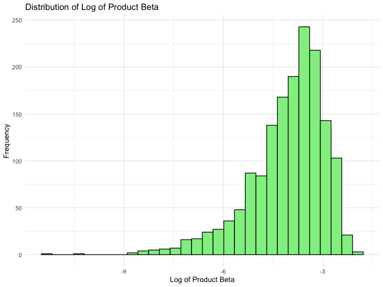
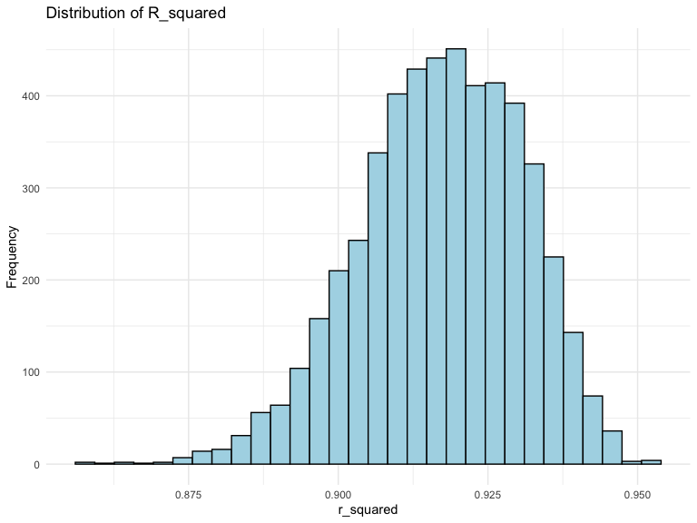
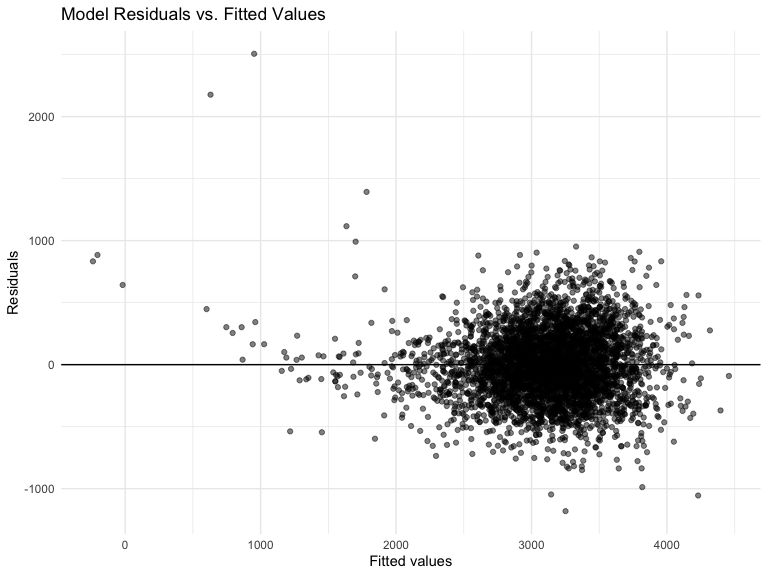
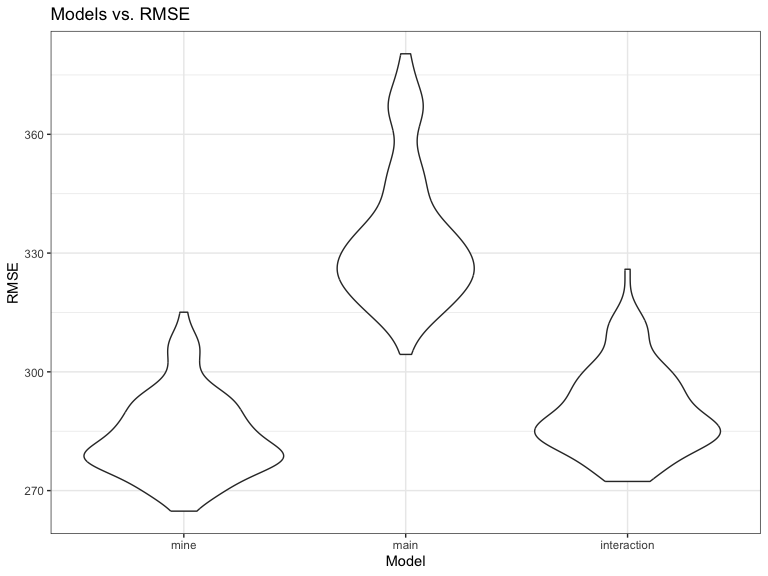

p8105_hw6_yw4199
================
Yaduo Wang
2023-11-29

``` r
library(tidyverse)
library(modelr)
library(mgcv)
```

## Problem 2

``` r
# download the data
weather_df = 
  rnoaa::meteo_pull_monitors(
    c("USW00094728"),
    var = c("PRCP", "TMIN", "TMAX"), 
    date_min = "2022-01-01",
    date_max = "2022-12-31") |>
  mutate(
    name = recode(id, USW00094728 = "CentralPark_NY"),
    tmin = tmin / 10,
    tmax = tmax / 10) |>
  select(name, id, everything())
```

``` r
# use the bootstrap to examine the distribution under repeated sampling
boot_straps = weather_df|> 
  modelr::bootstrap(n = 5000, id = "ID") |> 
  mutate(
    models = map(strap, \(df) lm(tmax ~ tmin + prcp, data = df)),
    results_estimate = map(models, broom::tidy),
    extr_r = map(models, broom::glance)) |> 
  select(-strap, -models) 

# produce estimates of log of product of beta and r-squared
beta_calculated = boot_straps |> 
  unnest(results_estimate) |> 
  group_by(ID) |> 
  summarize(product = prod(estimate)) |> 
  mutate(log_product = log(product))

r_square = boot_straps |> 
  unnest(extr_r) |> 
  group_by(ID) |> 
  summarize(r_squared = mean(r.squared))
```

``` r
# identify the 2.5% and 97.5% quantiles to provide a 95% confidence interval 
log_product_beta_ci = beta_calculated |> 
  summarize(
    ci_lower = quantile(log_product, 0.025, na.rm = TRUE),
    ci_upper = quantile(log_product, 0.975, na.rm = TRUE)
  )
r_square_ci = r_square |> 
  summarize(
    ci_lower = quantile(r_squared, 0.025, na.rm = TRUE),
    ci_upper = quantile(r_squared, 0.975, na.rm = TRUE)
  )
```

``` r
# Plot for log of product beta distribution
beta_calculated |>
  ggplot(aes(x = log_product)) +
  geom_histogram(fill = "lightgreen", color = "black") +
  theme_minimal() +
  labs(x = "Log of Product Beta", y = "Frequency", 
       title = "Distribution of Log of Product Beta")
```



``` r
# Plot for r_squared distribution
r_square |> 
  ggplot(aes(x = r_squared)) +
  geom_histogram(fill = "lightblue",color = "black") +
  theme_minimal() +
  labs(x = "r_squared", y = "Frequency", 
       title = "Distribution of R_squared")
```



The distribution of the log of the product of the beta shows that most
values are centered around -2.5 to -3.25. The distribution is left
skewed and this feature might be related to the outliers in the
bootstrap sample. The distribution of the r-squared is more normally
distributed and the values are centered around 0.92.

## Problem 3

``` r
#Load and clean the data for regression analysis.
birthweight <- read.csv("DATA/birthweight.csv")
birthweight = 
  birthweight |> 
#convert numeric to factor
  mutate(
    babysex = as.factor(babysex),
    frace = as.factor(frace),
    malform = as.factor(malform),
    mrace = as.factor(mrace)
  )
#check for missing data
colSums(is.na(birthweight))
```

    ##  babysex    bhead  blength      bwt    delwt  fincome    frace  gaweeks 
    ##        0        0        0        0        0        0        0        0 
    ##  malform menarche  mheight   momage    mrace   parity  pnumlbw  pnumsga 
    ##        0        0        0        0        0        0        0        0 
    ##    ppbmi     ppwt   smoken   wtgain 
    ##        0        0        0        0

After we loading the data, and convert some numeric variables to factor
variables as necessary, we check whether there exist missing values. As
shown in the results, there is no missing values in each variable.

``` r
#Propose a regression model for birth weight with all variables as predictor. 
fit_all = lm(bwt ~., data = birthweight)
summary(fit_all)
```

    ## 
    ## Call:
    ## lm(formula = bwt ~ ., data = birthweight)
    ## 
    ## Residuals:
    ##      Min       1Q   Median       3Q      Max 
    ## -1097.68  -184.86    -3.33   173.09  2344.15 
    ## 
    ## Coefficients: (3 not defined because of singularities)
    ##               Estimate Std. Error t value Pr(>|t|)    
    ## (Intercept) -6265.3914   660.4011  -9.487  < 2e-16 ***
    ## babysex2       28.7073     8.4652   3.391 0.000702 ***
    ## bhead         130.7781     3.4523  37.881  < 2e-16 ***
    ## blength        74.9536     2.0217  37.075  < 2e-16 ***
    ## delwt           4.1007     0.3948  10.386  < 2e-16 ***
    ## fincome         0.2898     0.1795   1.614 0.106551    
    ## frace2         14.3313    46.1501   0.311 0.756168    
    ## frace3         21.2361    69.2960   0.306 0.759273    
    ## frace4        -46.9962    44.6782  -1.052 0.292912    
    ## frace8          4.2969    74.0741   0.058 0.953745    
    ## gaweeks        11.5494     1.4654   7.882 4.06e-15 ***
    ## malform1        9.7650    70.6259   0.138 0.890039    
    ## menarche       -3.5508     2.8951  -1.226 0.220083    
    ## mheight         9.7874    10.3116   0.949 0.342588    
    ## momage          0.7593     1.2221   0.621 0.534418    
    ## mrace2       -151.4354    46.0453  -3.289 0.001014 ** 
    ## mrace3        -91.3866    71.9190  -1.271 0.203908    
    ## mrace4        -56.4787    45.1369  -1.251 0.210901    
    ## parity         95.5411    40.4793   2.360 0.018307 *  
    ## pnumlbw             NA         NA      NA       NA    
    ## pnumsga             NA         NA      NA       NA    
    ## ppbmi           4.3538    14.8913   0.292 0.770017    
    ## ppwt           -3.4716     2.6121  -1.329 0.183913    
    ## smoken         -4.8544     0.5871  -8.269  < 2e-16 ***
    ## wtgain              NA         NA      NA       NA    
    ## ---
    ## Signif. codes:  0 '***' 0.001 '**' 0.01 '*' 0.05 '.' 0.1 ' ' 1
    ## 
    ## Residual standard error: 272.5 on 4320 degrees of freedom
    ## Multiple R-squared:  0.7183, Adjusted R-squared:  0.717 
    ## F-statistic: 524.6 on 21 and 4320 DF,  p-value: < 2.2e-16

Select predictors that is significant with small p-value from the
summary of the model shown above.

``` r
# Fit more accurate model. 
fit_selected = lm(bwt ~ babysex + bhead + 
                    blength + delwt + gaweeks +
                    smoken, 
                  data = birthweight)
summary(fit_selected)
```

    ## 
    ## Call:
    ## lm(formula = bwt ~ babysex + bhead + blength + delwt + gaweeks + 
    ##     smoken, data = birthweight)
    ## 
    ## Residuals:
    ##      Min       1Q   Median       3Q      Max 
    ## -1181.20  -183.63    -9.49   174.43  2506.57 
    ## 
    ## Coefficients:
    ##               Estimate Std. Error t value Pr(>|t|)    
    ## (Intercept) -6285.7402    97.0521 -64.767  < 2e-16 ***
    ## babysex2       30.3364     8.7343   3.473 0.000519 ***
    ## bhead         137.1933     3.5353  38.806  < 2e-16 ***
    ## blength        78.8032     2.0720  38.033  < 2e-16 ***
    ## delwt           2.0766     0.1994  10.416  < 2e-16 ***
    ## gaweeks        14.0748     1.4976   9.398  < 2e-16 ***
    ## smoken         -2.1711     0.5823  -3.729 0.000195 ***
    ## ---
    ## Signif. codes:  0 '***' 0.001 '**' 0.01 '*' 0.05 '.' 0.1 ' ' 1
    ## 
    ## Residual standard error: 282 on 4335 degrees of freedom
    ## Multiple R-squared:  0.6973, Adjusted R-squared:  0.6969 
    ## F-statistic:  1665 on 6 and 4335 DF,  p-value: < 2.2e-16

``` r
# plot of model residuals against fitted values
birthweight |> 
  modelr::add_residuals(fit_selected) |> 
  modelr::add_predictions(fit_selected) |> 
  ggplot(aes(x = pred, y=resid)) + 
  geom_point(alpha = 0.5) + 
  geom_hline(yintercept = 0) +
  labs(x = "Fitted values", y = "Residuals", 
       title = "Model Residuals vs. Fitted Values")
```



``` r
# cross validation between two models 
cv_df =crossv_mc(birthweight, 100)
cv_df = 
  cv_df |> 
  mutate(
    train = map(train, as_tibble),
    test = map(test, as_tibble))

cv_df = 
  cv_df |> 
  mutate(
    mine_model = map(train, \(df) lm(bwt ~ babysex + bhead + 
                  blength + delwt + gaweeks + smoken, data = df)),
# One using length at birth and gestational age as predictors (main effects only)
    main_effect_mod  = map(train, \(df) lm(bwt ~ blength + gaweeks, data = df)),
# One using head circumference, length, sex, and all interactions (including the three-way interaction) between these.
    interaction_mod     = map(train, \(df) lm(bwt ~ bhead + blength + babysex + 
                                        bhead*blength +
                                        bhead*babysex +
                                        blength*babysex +
                                        bhead * blength * babysex, data = df))
   ) |> 
  mutate(
    rmse_mine = map2_dbl(mine_model, test, \(mod, df) rmse(model = mod, data = df)),
    rmse_main = map2_dbl(main_effect_mod, test, \(mod, df) rmse(model = mod, data = df)),
    rmse_interaction = map2_dbl(interaction_mod, test, \(mod, df) rmse(model = mod, data = df)))
```

``` r
# compare the distribution of RMSE in plots
cv_df |> 
  select(starts_with("rmse")) |> 
  pivot_longer(
    everything(),
    names_to = "model", 
    values_to = "rmse",
    names_prefix = "rmse_") |> 
  mutate(model = fct_inorder(model)) |> 
  ggplot(aes(x = model, y = rmse)) + geom_violin() + theme_bw() + 
  labs(x = "Model", y = "RMSE", 
       title = "Models vs. RMSE")
```



From the plot, we can see that our original model has the lowest RMSE,
so we think that our model might be better compared to other two models
in our senarios.

## Problem 1 Solutions

``` r
homicide_df = 
  read_csv("DATA/homicide-data.csv", na = c("", "NA", "Unknown")) |> 
  mutate(
    city_state = str_c(city, state, sep = ", "),
    victim_age = as.numeric(victim_age),
    resolution = case_when(
      disposition == "Closed without arrest" ~ 0,
      disposition == "Open/No arrest"        ~ 0,
      disposition == "Closed by arrest"      ~ 1)
  ) |> 
  filter(victim_race %in% c("White", "Black")) |> 
  filter(!(city_state %in% c("Tulsa, AL", "Dallas, TX", "Phoenix, AZ", "Kansas City, MO"))) |> 
  select(city_state, resolution, victim_age, victim_sex, victim_race)
```

``` r
baltimore_glm = 
  filter(homicide_df, city_state == "Baltimore, MD") |> 
  glm(resolution ~ victim_age + victim_sex + victim_race, family = binomial(), data = _)

baltimore_glm |> 
  broom::tidy() |> 
  mutate(
    OR = exp(estimate), 
    OR_CI_upper = exp(estimate + 1.96 * std.error),
    OR_CI_lower = exp(estimate - 1.96 * std.error)) |> 
  filter(term == "victim_sexMale") |> 
  select(OR, OR_CI_lower, OR_CI_upper) |>
  knitr::kable(digits = 3)
```

|    OR | OR_CI_lower | OR_CI_upper |
|------:|------------:|------------:|
| 0.426 |       0.325 |       0.558 |

``` r
model_results = 
  homicide_df |> 
  nest(data = -city_state) |> 
  mutate(
    models = map(data, \(df) glm(resolution ~ victim_age + victim_sex + victim_race, 
                             family = binomial(), data = df)),
    tidy_models = map(models, broom::tidy)) |> 
  select(-models, -data) |> 
  unnest(cols = tidy_models) |> 
  mutate(
    OR = exp(estimate), 
    OR_CI_upper = exp(estimate + 1.96 * std.error),
    OR_CI_lower = exp(estimate - 1.96 * std.error)) |> 
  filter(term == "victim_sexMale") |> 
  select(city_state, OR, OR_CI_lower, OR_CI_upper)

model_results |>
  slice(1:5) |> 
  knitr::kable(digits = 3)
```

| city_state      |    OR | OR_CI_lower | OR_CI_upper |
|:----------------|------:|------------:|------------:|
| Albuquerque, NM | 1.767 |       0.831 |       3.761 |
| Atlanta, GA     | 1.000 |       0.684 |       1.463 |
| Baltimore, MD   | 0.426 |       0.325 |       0.558 |
| Baton Rouge, LA | 0.381 |       0.209 |       0.695 |
| Birmingham, AL  | 0.870 |       0.574 |       1.318 |

``` r
model_results |> 
  mutate(city_state = fct_reorder(city_state, OR)) |> 
  ggplot(aes(x = city_state, y = OR)) + 
  geom_point() + 
  geom_errorbar(aes(ymin = OR_CI_lower, ymax = OR_CI_upper)) + 
  theme(axis.text.x = element_text(angle = 90, hjust = 1))
```


